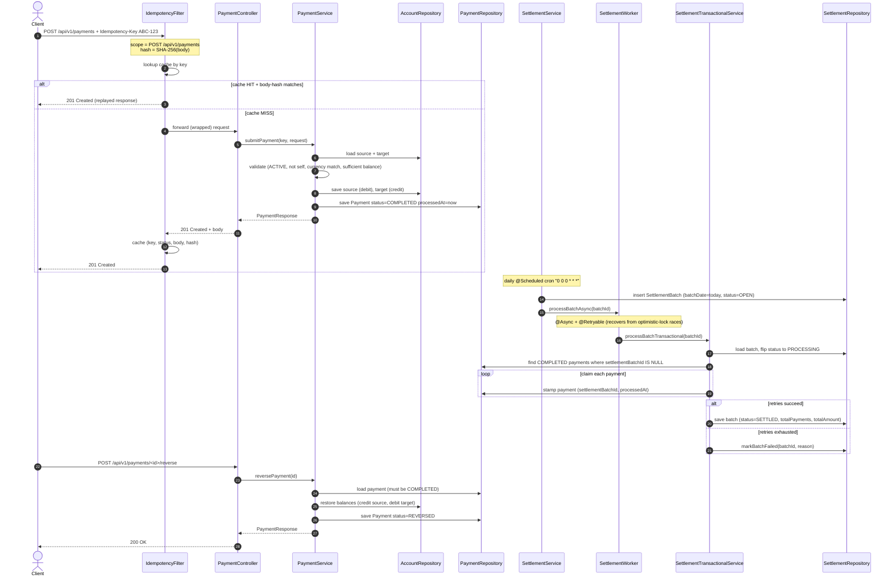

# Payment Settlement API

The Payment Settlement API is a backend service for processing double-entry financial transactions. It provides verifiable account ledgers, idempotent payment processing, and asynchronous batch settlement, all backed by an immutable audit trail to support regulatory compliance and internal reconciliation.

## Core Capabilities

* **Account Management:** Ledger operations supporting holding balances, freezing accounts for manual review, and strict zero-balance closure validations.
* **Idempotent Payments:** API-level idempotency preventing double-charging on network retries, backed by both database-level unique constraints and a fast-path cache.
* **Async Batch Settlement:** Scheduled, non-blocking jobs that aggregate pending ledger entries for downstream processing without degrading user-facing API latency.
* **Transient Failure Resilience:** Automatic retry pipelines wrapping cross-system calls and handling optimistic locking conflicts under high concurrency.
* **Reconciliation & Audit:** Append-only tracking of all state-changing operations and scheduled daily reconciliation reports for finance operations.
* **Transactional Persistence:** ACID-compliant operations ensuring atomic debit-and-credit transfers so funds are never created or destroyed.

## API Surface

| Method | Path | Purpose |
| ------ | ---- | ------- |
| POST | `/api/v1/accounts` | Open a new account with an initial balance and currency. |
| GET | `/api/v1/accounts` | Paged listing of all accounts. |
| GET | `/api/v1/accounts/{id}` | Read current status and balance of a specific account. |
| PATCH | `/api/v1/accounts/{id}/status` | Transition account state (ACTIVE, FROZEN, CLOSED). |
| POST | `/api/v1/payments` | Submit a payment between two accounts (requires `Idempotency-Key`). |
| GET | `/api/v1/payments` | Paged listing of payments, optionally filtered by status. |
| GET | `/api/v1/payments/{id}` | Read payment details. |
| POST | `/api/v1/payments/{id}/reverse` | Reverse a COMPLETED payment, restoring prior account balances. |
| GET | `/api/v1/settlements` | Paged listing of settlement batches. |
| GET | `/api/v1/settlements/{id}` | Read settlement batch details and totals. |
| POST | `/api/v1/settlements/{id}/process` | Manually dispatch the asynchronous claim-and-settle worker. |
| GET | `/api/v1/audit` | Query the immutable audit log, scoped by entity type and ID. |
| GET | `/api/v1/reports/daily` | Fetch the aggregated reconciliation tally for a specific date. |
| GET | `/actuator/health` | Operational liveness and readiness probe. |
| GET | `/swagger-ui.html` | Interactive OpenAPI 3.0 specification. |

## Key Domain Objects

### Account
| Field | Description |
| ----- | ----------- |
| `id` | Internal UUID identifier. |
| `accountNumber` | Human-readable identifier. |
| `balance` | Current balance (precision 18, scale 2). |
| `currency` | ISO 4217 standard (e.g., USD, EUR). |
| `status` | State of the ledger (`ACTIVE`, `FROZEN`, `CLOSED`). |

### Payment
| Field | Description |
| ----- | ----------- |
| `idempotencyKey` | Client-provided key enforcing exactly-once semantics. |
| `sourceAccountId` | Debited account context. |
| `targetAccountId` | Credited account context. |
| `amount` | Positive transfer amount. |
| `status` | Execution state (`PENDING`, `COMPLETED`, `FAILED`, `REVERSED`). |
| `failureReason` | Explanatory text if declined or failed. |
| `processedAt` | Timestamp of settlement finalization. |
| `settlementBatchId` | Optional foreign key mapping to the daily batch. |

### SettlementBatch
| Field | Description |
| ----- | ----------- |
| `batchDate` | The ledger date this batch aggregates. |
| `status` | Batch processing state (`OPEN`, `PROCESSING`, `SETTLED`, `FAILED`). |
| `totalPayments` | Tally of claimed payments within this batch. |
| `totalAmount` | Aggregated monetary volume for the batch window. |

## Idempotency Contract

All payment submissions require an `Idempotency-Key` HTTP header.
* The system guarantees exactly-once execution for identical requests carrying the same key.
* A concurrent or subsequent request with the same key will transparently return the cached HTTP response (e.g., repeating a successful request yields the original 201 Created and response body).
* This provides safety for clients retrying across transient network drops.
* Key records are maintained by the system and eventually purged by an hourly scheduled cleanup job enforcing a 24-hour Time-To-Live (TTL).

## Settlement Model

Settlement operates asynchronously using `@Async` workers, dispatched organically by a daily `@Scheduled` job or manually via API. The architecture decouples the immediate point-of-sale API path from the heavy batch finalization layer.
During execution, the batch transitions dynamically from `OPEN` to `PROCESSING`, eventually culminating in `SETTLED` (or `FAILED` upon irrecoverable faults). The worker thread employs `@Retryable` semantics to seamlessly survive optimistic locking contention when updating heavily utilized ledgers.

## Payment Lifecycle

The diagram below traces a single payment from the moment a client submits it through to settlement reconciliation and, when invoked, reversal. The happy path runs in two phases: a synchronous request-time phase (idempotency check plus atomic debit/credit plus ledger update) and an asynchronous mid-batch phase where the daily settlement job claims and seals the payment into a `SETTLED` batch.



The submission phase (top half) guarantees exactly-once execution via the cache plus a database-level unique constraint on `idempotency_key`; the inner transaction boundary on `submitPayment` makes the debit and credit indivisible — a malformed request rolls the entire transaction back without partial ledger drift. The settlement phase (middle) decouples user-facing latency from batch reconciliation; a payment reads `COMPLETED` to the client the moment it commits, but the ledger-wide totals are sealed only when the daily worker claims it into a `SETTLED` batch. The reverse path (bottom) restores the source and target balances and stamps `REVERSED` on the original payment record, leaving an audit-traceable history of the lifecycle end-to-end.

## Error Model

The API leverages standard RFC-7807 envelopes for structured error responses, maintaining a reliable contract across the entire surface.
* **4xx Client Errors:** Invalid domain interactions resulting in rejection. Frequent causes include insufficient balance (`HTTP 422`), transacting across differing currencies (`HTTP 422`), operations targeting an inactive account (`HTTP 409`), disallowed self-transfers (`HTTP 400`), non-positive transaction amounts (`HTTP 400`), or re-using an idempotency key with an already-resolved distinct envelope (`HTTP 409`).
* **5xx Server Errors:** Signals uncaught internal faults, infrastructural saturation, or irrecoverable states.

## Run Locally

The application defaults to a development profile mapped to an in-memory H2 database, requiring no external backing services.

```bash
# Start the application on default port 8080
mvn spring-boot:run

# Verify service health
curl -s http://localhost:8080/actuator/health

# Open OpenAPI interactive documentation
open http://localhost:8080/swagger-ui.html

# Access the H2 console (JDBC URL: jdbc:h2:mem:paymentdb)
open http://localhost:8080/h2-console

# Provision a test account
curl -X POST http://localhost:8080/api/v1/accounts \
  -H "Content-Type: application/json" \
  -d '{
    "accountNumber": "ACC-5521",
    "accountHolder": "Corporate Treasury",
    "initialBalance": "100000.00",
    "currency": "USD"
  }'
```

## Technology Stack

| Component | Choice |
| --------- | ------ |
| Runtime | Java 21, Spring Boot 3.5.x |
| Persistence | Spring Data JPA / Hibernate |
| Database | H2 (Dev) / PostgreSQL (Prod) |
| Async / Resiliency | Spring `@Async`, Spring Retry |
| Security / Compliance | Spring AOP for audit logging, JPA `@Version` locks |
